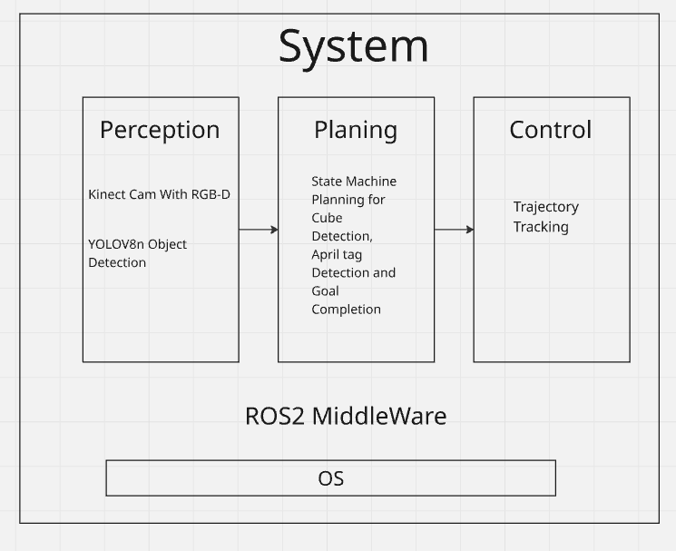
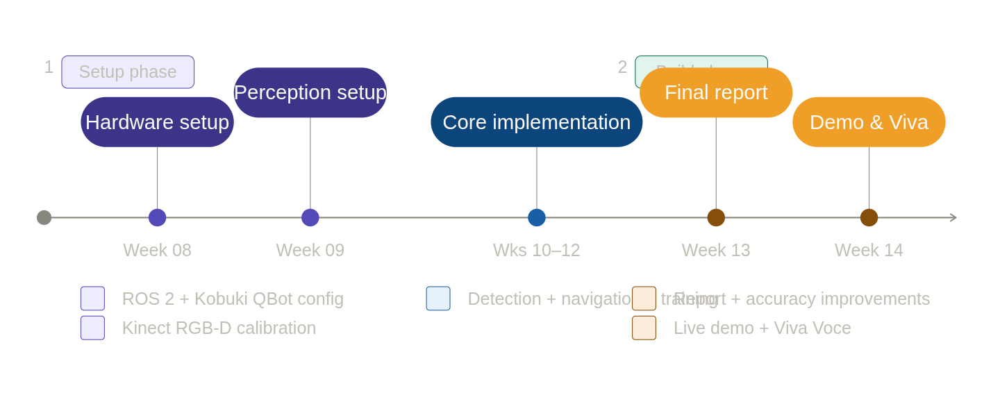
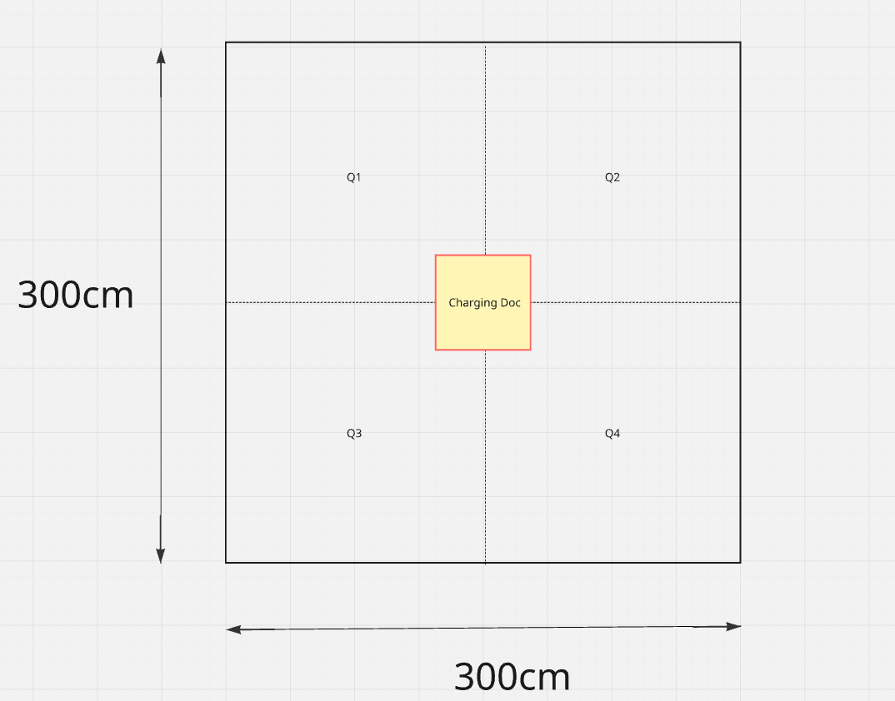

# BotZilla: An Autonomous Object Detection, Collection & Placement Robot

<div align="center">


**CS3340 - Robotics and Automation | Computer Science and Engineering, University of Moratuwa**

*An autonomous mobile robot that detects, collects, and places cubes using YOLO-based vision and RGB-D sensing on the Kobuki QBot platform.*

</div>

---

## 1. Overview

In this final project we are building robot(Kobuki-Qbot) that operates in a controlled indoor environment. Starting from a charging station(middle of the arena), the robot searches for cubes, collects them using a maipulator arm, deposits them in a designated drop-off zone, and returns to dock, all without human intervention.

The project is motivated by real-world applications such as:
- Automated sorting in logistics warehouses
- Debris clearance in hazardous environments
- Educational robotics demonstrations

The system is built on three core robotics pillars: **Perception**, **Planning**, and **Control**, integrated via the ROS 2 framework.

---

## 2. System Architecture



### 3. State Machine Flow

```
[CHARGING DOCK] ──▶ [SEARCH] ──▶ [APPROACH] ──▶ [PICK]
                        ▲                           │
                        │                           ▼
                   [RETURN]  ◀──  [PLACE]  ◀── [NAVIGATE TO ZONE]
```

---

## 4. Hardware Components

| Component | Details |
|-----------|---------|
| **Mobile Base** | Kobuki QBot (differential-drive) |
| **Vision System** | Xbox Kinect RGB-D Camera |
| **Compute** | Raspberry Pi 4 (4GB) |
| **Manipulator** | Simple gripper arm attached to base |
| **Power** | Kobuki battery with charging dock + voltage monitoring sensor |

---

## 5. Software Stack

| Layer | Technology |
|-------|-----------|
| **Framework** | ROS 2 Jazzy |
| **Object Detection** | YOLOv8 Nano |
| **Depth Processing** | Point Cloud Library (PCL) |
| **Task Sequencing** | SMACH State Machine |
| **Simulation** | Gazebo |
| **Localisation Markers** | AprilTags |

---

## 6. Getting Started

### Prerequisites

- Ubuntu 22.04 (or compatible)
- ROS 2 Jazzy installed
- Python 3.10+
- Gazebo (for simulation) 

### Installation
Note that the rasberrypi integration in the following branch.

[Click Here](insert_link_brnch) 


```bash
# Clone the repository
git clone https://github.com/IntellisenseLab/final-project-botzilla
cd botzilla

# Install Python dependencies
pip install -r requirements.txt

# Build the ROS 2 workspace
colcon build --symlink-install
source install/setup.bash
```

### Running in Simulation (Gazebo)

```bash
# Launch the Gazebo simulation environment
ros2 launch botzilla simulation.launch.py

# In a new terminal, start the main autonomy stack
ros2 launch botzilla botzilla_autonomy.launch.py
```

### Running on Hardware

```bash
# Ensure Kobuki and Kinect are connected, then:
ros2 launch botzilla hardware.launch.py

# Start the autonomy stack
ros2 launch botzilla botzilla_autonomy.launch.py
```

---

## 7. Repository Structure

```
final-project-botzilla/           
├── botzilla_Workspace/src/
│   ├── botzilla_bringup/          
│   ├── botzilla_control/           # drive base control
│   ├── botzilla_perception/        # yolo and apriltag detection     
│
├── datasets/                       # Cube Dataset
├── docs/                           # documents 
├── runs/                    # Best Fited ML models 
├── tests/                   # Unit and integration tests
├── Worlds/
├── requirements.txt
└── README.md
```

---

## 8. Expected Outcomes

-  **≥ 80% accuracy** in cube detection and localization under varying lighting conditions
-  Successful collection and placement of **all cubes** in the drop-off zone (0.5m × 0.5m)
-  Safe return to the **charging dock** after task completion
- No fault tolerance issues with the **gripper arm** during manipulation

---

## 9. Project Timeline





---

## 10. Team BotZilla

| Name | Index | Responsibilities |
|------|-------|-----------------|
| **Mudaliarachchi N.S** | 230415H | RGB-D depth sensing, dataset collection, model training |
| **H.H. Malavipathirana** | 230389E | QBot command configuration, key-command programming, object detection & navigation |
| **K.N.B. Abeysundara** | 230010L | Raspberry Pi setup, YOLOv8 pipeline, ROS 2 integration, final report |

---

## 11. References

- [Blob Tracking using Kobuki QBot2](https://www.youtube.com/watch?v=L_A1ThF3q6Y)
- [Raspberry Pi 5— Setup & Getting Started](https://www.youtube.com/watch?v=2RHuDKq7ONQ)
- [YOLO on Raspberry Pi](https://youtu.be/z70ZrSZNi-8?si=31wIvSw6LGXEnhvU)
- [Kobuki QBot Documentation](https://kobuki.readthedocs.io/en)
- [Cube Dataset — Roboflow](https://universe.roboflow.com/zeynabezzati/dataset-yzhqr)
---
## Arena Configuration 



The Arena is 300cm*300cm and the charging doc, where robot starts action, is in the middle of the arena. The robot splits arena in to 4 quadrents and those are represented using dashed lines.

## 🏛️ Affiliation

**Department of Computer Science and Engineering**  
University of Moratuwa  
CS3340 — Robotics and Automation | March 2026

---